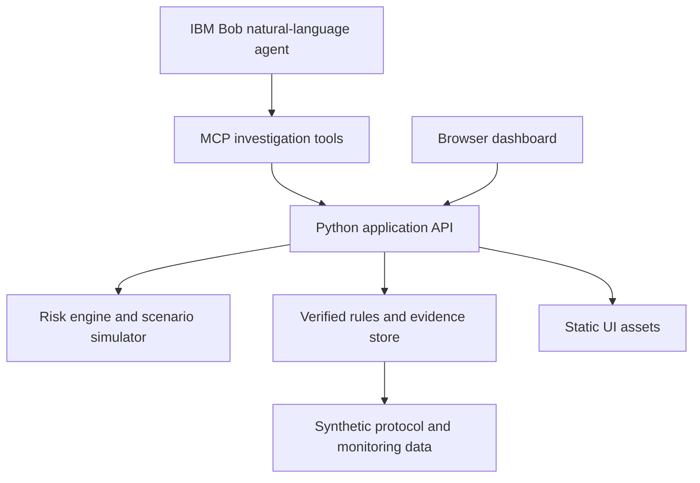

# Architecture

## System Architecture

The current prototype uses Python's standard library to keep the hackathon demo easy to run. The API owns the seeded source of truth, while the browser renders the radar, site intelligence, Bob investigation, and scenario result.

## Components

| Component | Technology | Responsibility |
|---|---|---|
| Dashboard | HTML, CSS, JavaScript | Risk radar, evidence chain, confidence, and scenario controls |
| Backend API | Python `http.server` | Serves assets and returns structured intelligence responses |
| Risk engine | Deterministic Python logic | Site ranking, trajectory values, and intervention projection |
| Evidence store | Seeded in-memory structures | Rules, deviations, monitoring periods, and evidence IDs |
| Bob boundary | JSON endpoint, MCP-ready | Returns an investigation answer with source labels |
| Future persistence | SQLite | Planned durable evidence and CAPA records |

## Data Flow

1. The API loads synthetic sites, rules, and evidence records from deterministic seed structures.
2. `/api/overview` returns site ranking and summary metrics for the Trial Risk Radar.
3. `/api/sites/S037/intelligence` returns the risk index, trajectory, drivers, confidence, and evidence chain.
4. `/api/bob/investigate` represents the Bob/MCP investigation request and returns source-labeled reasoning.
5. `/api/sites/S037/simulate` accepts a driver reduction percentage and returns projected risk and status.
6. The browser updates the dashboard without embedding clinical data or secrets.

## Security Considerations

- All current data is synthetic and contains no patient-identifying information.
- The local demo requires no credentials.
- Optional IBM Bob variables belong in a local `.env` file and are represented only by `src/.env.example`.
- Production deployment must add authentication, encrypted secret storage, audit logging, and least-privilege tool permissions.

## Scalability Notes

The API and UI are separated by JSON contracts, so the in-memory seed can be replaced by SQLite without changing the screen workflow. A production version would add a proper FastAPI service, background protocol extraction, indexed evidence queries, authenticated MCP tools, and immutable decision audit records.
