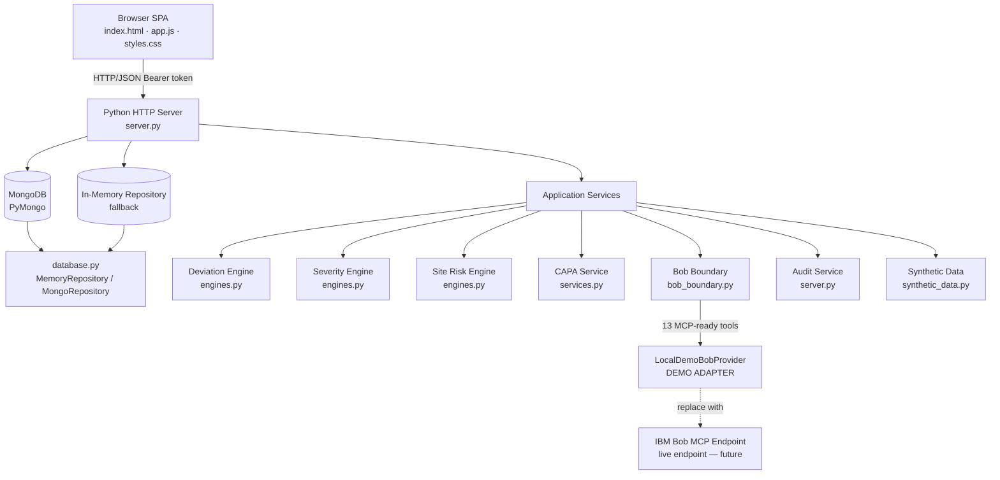
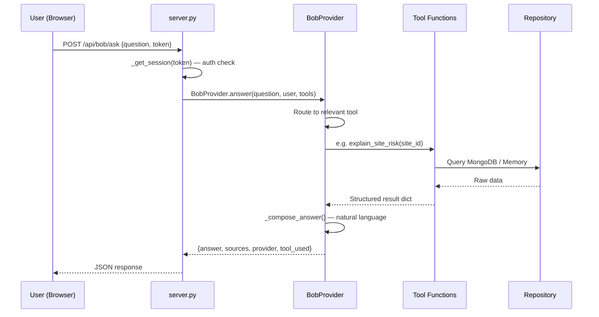

# Architecture — TrialGuard AI

## Overview

TrialGuard AI is a single-server Python web application with a vanilla JavaScript SPA frontend, a REST JSON API backend, and a MongoDB persistence layer (with automatic in-memory fallback).

The application supports **two distinct integration paths** that share the same underlying business logic.

---

## Integration Path A — Local Demo Mode (Web Application)

```
Browser (SPA)
     |
     | POST /api/bob/ask
     v
server.py
     |
     v
LocalDemoBobProvider   ← DEMO ADAPTER, NOT IBM BOB
     |
     | Intent classification → TrialGuard tool selection
     v
build_bob_tools(repo, session)
     |
     v
TrialGuard tool implementations
     |
     v
MongoDB / in-memory repository
```

**What it is:** A deterministic keyword-routing adapter for web demo purposes. It classifies
user intent into one of 13 TrialGuard categories or returns an UNSUPPORTED response. It is clearly
labelled "DEMO BOB ADAPTER (not IBM Bob)" in all responses.

**What it is not:** It is not IBM Bob. It does not use LLM reasoning. It does not use the MCP protocol.

### Intent Categories (Local Demo Adapter)

| Intent | Tool | Example |
|---|---|---|
| TRIAL_OVERVIEW | `get_trial_overview` | "Give me a summary of the trial" |
| HIGH_RISK_SITES | `list_high_risk_sites` | "Which sites are high risk?" |
| SITE_RISK_EXPLANATION | `explain_site_risk` | "Why is Site S037 high risk?" |
| SITE_RISK | `get_site_risk` | "What is S037's risk score?" |
| SITE_TRENDS | `get_site_trends` | "Is S037's risk getting worse?" |
| SITE_DEVIATIONS | `list_site_deviations` | "Show me deviations at S037" |
| SITE_ACTIONS | `recommend_site_actions` | "What actions are recommended for S037?" |
| CAPA_GENERATION | `generate_capa` | "Generate a CAPA for S037" |
| CAPA_STATUS | `get_capa_status` | "What CAPAs are open?" |
| RISK_REPORT | `generate_risk_report` | "Generate a risk report for S037" |
| PROTOCOL_RULES | `search_protocol_rules` | "Show me protocol rules about dosing" |
| PATIENT_PROTOCOL | `compare_patient_to_protocol` | "Check patient P-001 against protocol" |
| **COMPARE_SITES** | `get_site_risk` + `get_site_trends` + `list_site_deviations` × 2 | "Compare S001 vs S032" |
| **UNSUPPORTED** | *none* | "hello", "tell me a joke", "what is the weather" |

Non-TrialGuard messages (greetings, jokes, weather questions, etc.) always return an UNSUPPORTED
response that guides the user to ask a TrialGuard-related question. No tool is called.

---

## Integration Path B — Real IBM Bob + MCP (IMPLEMENTED)

```
IBM BOB
     |  natural language question
     v
MCP Client (IBM Bob built-in)
     |  STDIO
     v
src/mcp_server.py   ← REAL MCP SERVER
     |
     | 13 registered MCP tools (adapter layer only)
     v
build_bob_tools(repo, session)   ← same boundary as Path A
     |
     v
TrialGuard tool implementations
     |
     v
MongoDB / in-memory repository
```

**What it is:** A real MCP server using `mcp[cli]>=2.2` that IBM Bob connects to via STDIO. IBM Bob
performs natural-language reasoning and selects the appropriate TrialGuard tool. The MCP server is
an adapter only — no business logic is duplicated.

**Configured in:** `.bob/mcp.json` (project-level, workspace-scoped)

**Transport:** STDIO (IBM Bob launches `src/mcp_server.py` as a subprocess)

## System Architecture



## IBM Bob Integration — Web Demo Path



## IBM Bob Integration — Real MCP Path (IMPLEMENTED)

```
                     IBM BOB
                        |
                   MCP CLIENT
                        |
                     STDIO
                        |
                        v
           +------------------------+
           | TrialGuard MCP Server  |
           | src/mcp_server.py      |
           +----------+-------------+
                      |
             13 MCP tools (adapter layer)
                      |
                      v
           +------------------------+
           | TrialGuard Tool        |
           | Boundary               |
           | build_bob_tools()      |
           | bob_boundary.py        |
           +----------+-------------+
                      |
                      v
           +------------------------+
           | Existing Services      |
           | services.py            |
           | engines.py             |
           +----------+-------------+
                      |
                      v
                  MongoDB
```

### MCP Configuration

IBM Bob discovers and launches the TrialGuard MCP server using `.bob/mcp.json`:

```json
{
  "mcpServers": {
    "trialguard": {
      "command": "python",
      "args": ["${workspaceFolder}/src/mcp_server.py"],
      "env": {
        "TRIALGUARD_BOB_ROLE": "STUDY_MANAGER",
        "TRIALGUARD_BOB_USER_ID": "bob-demo",
        "TRIALGUARD_BOB_SITE_ID": ""
      }
    }
  }
}
```

### Session / Identity

The MCP server reads three environment variables to construct the TrialGuard session:

| Variable | Default | Notes |
|---|---|---|
| `TRIALGUARD_BOB_ROLE` | `STUDY_MANAGER` | Role for RBAC checks |
| `TRIALGUARD_BOB_USER_ID` | `bob-demo` | User identity for audit trail |
| `TRIALGUARD_BOB_SITE_ID` | `` (empty) | Empty = cross-site access for STUDY_MANAGER |

Both paths share `build_bob_tools(repo, sess)` — there is one source of truth for all business logic.

## MCP-Ready Tool Contracts

Each tool in `TOOL_REGISTRY` has:
- `tool_name` — unique identifier
- `description` — human-readable purpose
- `input_schema` — JSON Schema for parameters
- `output_schema` — JSON Schema for return value
- `roles` — list of allowed roles (enforced server-side)

The 13 tools:

| Tool | Description |
|---|---|
| `get_trial_overview` | Trial-level KPIs |
| `list_high_risk_sites` | Ranked high-risk sites with leading indicators |
| `get_site_risk` | Current + projected risk for one site |
| `explain_site_risk` | Evidence-backed risk driver explanation |
| `list_site_deviations` | Deviations for an authorized site |
| `get_deviation` | Single deviation with full evidence |
| `search_protocol_rules` | Protocol rule search |
| `compare_patient_to_protocol` | Patient eligibility check |
| `get_site_trends` | Risk trend and sparkline |
| `recommend_site_actions` | Corrective/preventive action suggestions |
| `generate_capa` | CAPA suggestion from real deviations |
| `get_capa_status` | CAPA records and status summary |
| `generate_risk_report` | Structured risk report payload |

## Repository Pattern

```
MemoryRepository (database.py)
  └── MongoRepository  (extends, overrides with pymongo calls)

Both implement:
  all(collection)
  find_one(collection, field, value)
  find_many(collection, field, value)
  insert(collection, item)
  update(collection, field, value, changes)
```

`create_repository()` tries MongoDB first; falls back to `MemoryRepository` automatically.

## Data Collections

| Collection | Contents |
|---|---|
| `users` | Demo accounts with hashed passwords and roles |
| `sites` | 42 synthetic clinical sites with profiles |
| `patients` | 1128 synthetic patients (no real data) |
| `protocols` | TG-101 protocol with 8 rules |
| `visits` | ~5100 visit records per patient |
| `medications` | ~1250 concomitant medication records |
| `deviations` | ~975 protocol deviations with evidence (7 types, all 8 rules evaluated) |
| `risk_scores` | 42 site risk scores with leading indicators |
| `capa_records` | CAPA records linked to deviations |
| `audit_events` | All system events |

## Authentication and Authorization

- Passwords hashed with PBKDF2-SHA256 (120,000 iterations)
- Sessions: server-side dictionary keyed by `secrets.token_hex(32)`
- Token returned in JSON body (`token` field) and `Set-Cookie: tg_session`
- Every API endpoint checks `_get_session(token)` before proceeding
- Site scope enforced by `_site_scope(session, site_id)` per request
- Bob tools enforce same scope via `_check_site_scope()` inside `build_bob_tools()`

## Severity Classification

6-factor prototype scoring (not ICH/FDA guidance):

| Factor | Max |
|---|---|
| Safety impact | 5 |
| Data integrity | 5 |
| Protocol criticality | 4 |
| Participant rights | 5 |
| Magnitude | 3 |
| Recurrence | 3 |

Thresholds: 0–3 = ADMINISTRATIVE · 4–9 = MINOR · 10+ = MAJOR

## Site Risk Engine

Multi-factor scoring (not regulatory risk stratification):

| Factor | Weight |
|---|---|
| Deviation frequency | up to 20 |
| Major deviation count | up to 25 |
| Recurrence (same type > 2×) | up to 15 |
| Recent acceleration | 8 |
| Dosing error frequency | up to 12 |
| Missed visit frequency | up to 10 |
| Data-entry delay frequency | up to 5 |

Score 0–100 · Levels: LOW (<35) · MEDIUM (35–64) · HIGH (≥65)
Demo overrides: S037=87, S008=76, S021=71

## Frontend Architecture

Single-page application, no framework:

```
index.html          — HTML skeleton, page sections, modals
styles.css          — Design system variables, component styles
app.js              — All JS: auth, nav, page loaders, API calls, Bob chat, charts
```

Charts rendered by Chart.js (CDN). All data fetched from the backend API — no hardcoded values.
