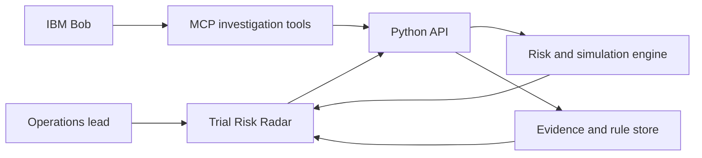

# Solution Overview

## What We Built

Clinical Trial Risk Intelligence Copilot is an evidence-first operational radar for synthetic clinical-trial data. It answers four questions in sequence: where should I look, why does this site need attention, what happens if we intervene, and how will we verify the next period?

## How It Works

1. The application loads a deliberately constructed synthetic trial dataset with sites, monitoring periods, protocol rules, deviations, and evidence IDs.
2. Verified rules feed a deterministic compliance and evidence model. Every hero-site deviation points back to a rule, patient, period, and evidence record.
3. The risk engine ranks sites using current burden, normalized peer comparison, trend velocity, acceleration, and risk concentration. CUSUM-style emerging-risk behavior is the primary early-warning signal.
4. Site Intelligence explains S037's risk: recurring V3 scheduling deviations make up 72% of the burden and are rising across five periods.
5. IBM Bob is given a focused investigation boundary through MCP-ready tools. The demo response cites the risk engine, evidence store, and rule R-03.
6. The Scenario Lab models a 30% reduction in the dominant driver and returns a projected risk and status change.
7. The next implementation step is to turn the tested scenario into an evidence-linked CAPA and re-measure it in the following seeded monitoring period.

## Architecture Diagram

See [architecture.md](architecture.md) for the detailed view.

## Key Design Decisions

| Decision | Rationale |
|---|---|
| Use deterministic compliance checks | A recommendation must be reproducible and traceable to a verified rule. |
| Make velocity primary for emerging risk | Raw counts alone miss sites whose burden is accelerating. |
| Keep evidence visible beside every explanation | Investigators need to prove a finding, not only receive a score. |
| Simulate before recommending action | The team can compare a targeted intervention with its projected operational impact. |
| Seed synthetic data with a clear narrative | The demo is repeatable without exposing clinical or patient information. |

## IBM Technologies Used

- **IBM Bob:** The intended natural-language investigator experience. Bob asks focused questions such as why S037 is becoming risky and receives an evidence-backed answer.
- **MCP:** The integration boundary for structured investigation tools that retrieve risk, drivers, evidence, and scenario results from one backend source of truth.

The local prototype keeps this boundary dependency-free so the core workflow is demonstrable without committing credentials.
